### The homelab

Six OptiPlex Micros, a MikroTik network and an R730xd NAS, all declared in Git. Talos for the OS, Flux for everything in the cluster, Terraform for the network.

**[Repo](https://github.com/Lil-Strudel/homelab)** · **[Read the book →](https://lil-strudel.github.io/homelab/)**

### Also building

- **[.dotfiles](https://github.com/Lil-Strudel/.dotfiles)**: my whole Arch + Hyprland machine, hand-rolled. Every line has to earn its place.
- **[GlassAct Studios](https://github.com/Lil-Strudel/glassact-studios)**: ordering platform for custom stained-glass inlays. Go, SolidJS, Terraform on AWS.
- **[discord-audio-streamer](https://github.com/Lil-Strudel/discord-audio-streamer)**: pipe files, YouTube links or any audio device into a Discord voice channel.
- **[ChekkPoint](https://github.com/Lil-Strudel/ChekkPoint)**: offline-first race timing for aid stations.

<a href="https://lilstrudel.io">lilstrudel.io</a>

