### What I'm building

- **[homelab](https://github.com/Lil-Strudel/homelab)**: bare-metal Kubernetes declared from the metal up, from Talos and Flux to the MikroTik network. [Read the book →](https://lil-strudel.github.io/homelab/)
- **[GlassAct Studios](https://github.com/Lil-Strudel/glassact-studios)**: ordering platform for custom stained-glass inlays. Go API, SolidJS app, Astro site, Terraform on AWS.
- **[ChekkPoint](https://github.com/Lil-Strudel/ChekkPoint)**: offline-first race timing that keeps working when the cell signal doesn't. TanStack Start, Drizzle, Electric.
- **[discord-audio-streamer](https://github.com/Lil-Strudel/discord-audio-streamer)**: Go + Wails desktop app that pipes any audio into a Discord voice channel.
- **[.dotfiles](https://github.com/Lil-Strudel/.dotfiles)**: my whole Arch + Hyprland machine, hand-rolled.

<picture>
  <source media="(prefers-color-scheme: dark)" srcset="https://raw.githubusercontent.com/Lil-Strudel/Lil-Strudel/output/snake-dark.svg">
  
</picture>

<a href="https://lilstrudel.io">lilstrudel.io</a>

